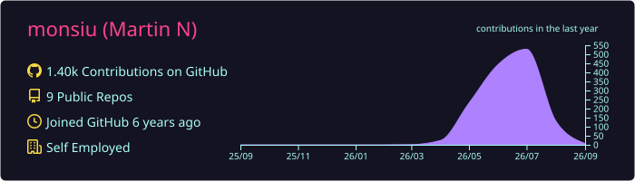
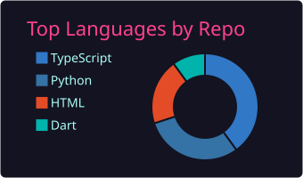
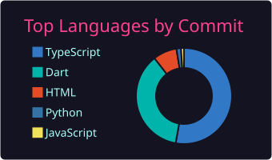
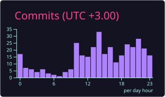
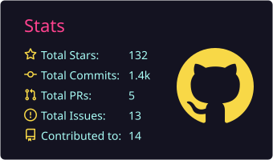

# Hi there, I'm Martin Nzau (Monsiu) 👋

<!--
  Profile-details banner is generated statically by .github/workflows/profile-summary-cards.yml
  (no more Vercel rate limits). It needs a token with `read:user` scope because the card queries
  your email field. Once the PROFILE_CARDS_TOKEN secret has read:user, re-run the workflow and
  restore the banner below:
  

    
  

-->

🌍 Full-Stack, Mobile & Smart Contract developer based in **Nairobi, Kenya**, available worldwide.
I build production web apps, Android apps with Flutter, and onchain smart contracts.

## Here's a bit about me:
- 🔭 I'm building [**ClauseShift**](https://clauseshift.com), an AI contract reviewer that cites the exact clause behind every risk it flags, live on the web and the Amazon Appstore. Also maintaining [**Custom RR**](https://github.com/monsiu/Custom-RR), a cross-platform hub for Android custom ROMs, recoveries, and root.
- 💬 Ask me about: React, Next.js, TypeScript, Flutter/Dart, Solidity smart contracts, and AI integration.
- 🌱 I'm currently building onchain micropayment systems and agentic AI workflows.
- 🏆 Hackathon contributor across AMD, Arc Blockchain, TechEx, and Milan AI Week.
- 💼 Verified [Upwork freelancer](https://www.upwork.com/freelancers/~01d848dcebdf54f162) - [hire me](https://monsiu.github.io/services/).
- 📫 How to reach me: [LinkedIn](https://linkedin.com/in/martinnzau) · [X/Twitter](https://x.com/MonsiuTech) · [Website](https://monsiu.github.io/) · contactmonsiu@gmail.com

## 🚀 Featured projects
- ⚖️ [**ClauseShift**](https://clauseshift.com) - AI contract review that shows its receipts: every flagged risk quotes the exact source clause, with two-model cross-checks, risk scoring, and automatic key-date extraction. One product across web, Android, iOS, and desktop, with a free tier plus Pro. Flutter, Next.js, Supabase, OpenAI.
- 📱 [**Custom RR**](https://github.com/monsiu/Custom-RR) - A single home for popular Android custom ROMs, recoveries, and root solutions. 18 ROMs, 4 recoveries, 700+ devices, nightly freshness signals. Flutter, GPL-3.0.
- 💸 [**NanoPay**](https://github.com/monsiu) - Per-request AI API where every query costs $0.001 USDC, settled onchain on Arc blockchain. 57+ live onchain transactions. Solidity, Node.js.
- ️ [**Aegis, SRE Guardian**](https://github.com/monsiu/Autonomous-SRE-Self-Healing-Cloud-Guardian) - Autonomous incident-response system with a three-agent AI pipeline and auto-generated post-mortems. Built for AMD Developer Hackathon 2025. Python, FastAPI, React.

## 🛠️ Tech I work with

## 📊 My GitHub stats
<!-- These cards are generated statically by .github/workflows/profile-summary-cards.yml, so they
     are never rate-limited by the shared Vercel service. -->

    
    

    

<!--
  The aggregate stats card (total stars / commits / PRs / issues) also generates statically, but
  it needs a token with `read:user` scope (it queries your email field). Once the
  PROFILE_CARDS_TOKEN secret has read:user, re-run the workflow and add it back here:
  
-->

## 📈 Commit history

    

